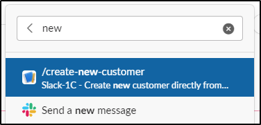
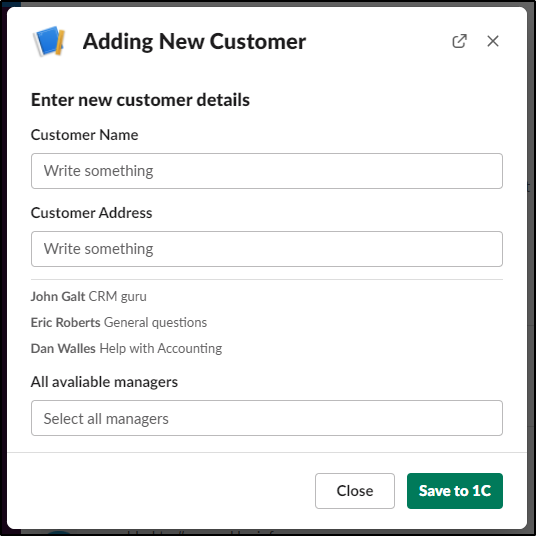
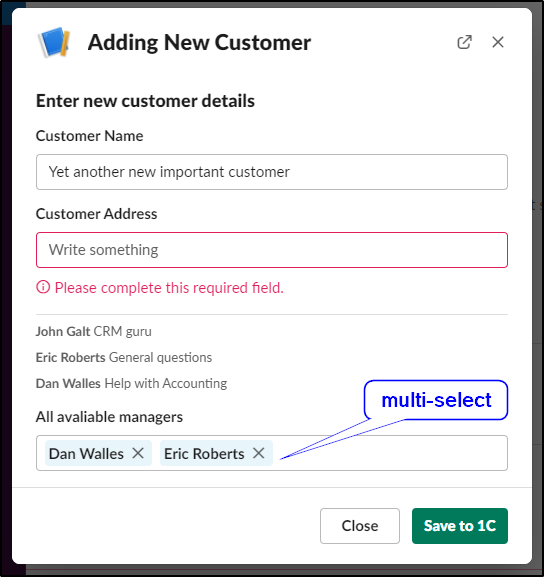
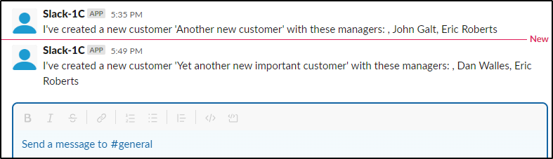
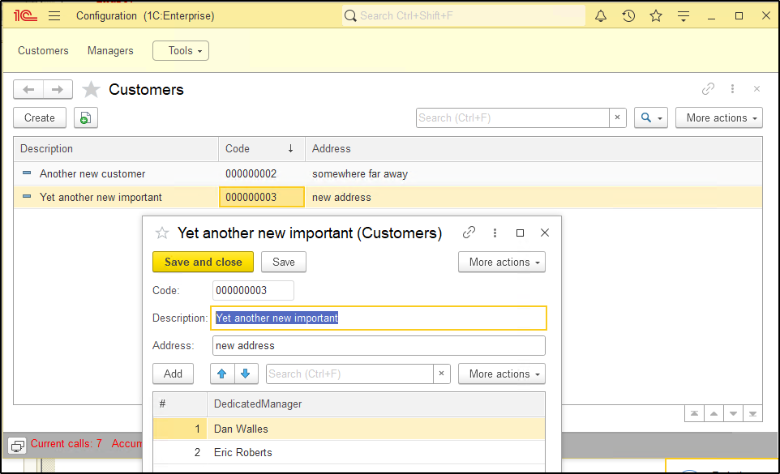

# An example of direct integration 1C:Enterprise and Slack
This example demonstrates the two-way integration of 1C:Enterprise and Slack with the transfer of user data between the two systems.

There are many ways to build this integration. 
Given the fact that Slack makes calls on the server side, the 1C:Enterprise solution must be publicly available.
One of the ways to reduce security risks is to use AWS Lambda as a request proxy - it implies that the 1C:Enterprise Infobase is running in AWS.
*This example does not include any security checks or configurations that you must have in place in the production environment.*

## High-level configuration
- Slack application that initiates API calls
- AWS Lambda function with public URL
- Web-server with published 1C:Enterprise HTTP services 
- 1C:Enterprise infobase as the data processor and the data target location

### AWS Lambda configuration:
- create a new Lambda fuction within the same region as your 1C:Enterprise web-server
- use Python 3.x
- add a new Function URL (Configuration page) - this URL will be used by Slack as the API target
- add Python code to proxy the request - modify the target instance IP or DNS name
```python
import json
import urllib3
import os


def lambda_handler(event, context):
    
    http = urllib3.PoolManager()

    r = http.request('POST', 'http://<1C:Enterprise Web Server>/slack/hs/slack/customer-form',
                 headers={'Content-Type': 'application/json'},
                 body=json.dumps(event))
                 
    result = r.data
    
    return {
        'statusCode': 200,
        'headers': {'Content-Type': 'application/json'},
        'body': result
    }
```

### Create new Slack Application
The easiest option is to use the Slack App Manifest - modify the URL to the AWS Lambda public URL.
Publish the app into your workplace and add it into the channel where you want to receive response results.
```
display_information:
  name: Slack-1C
features:
  bot_user:
    display_name: Slack-1C
    always_online: false
  slash_commands:
    - command: /create-new-customer
      url: https://your-lambda-id.lambda-url.us-west-2.on.aws/
      description: Create new customer directly from Slack
      should_escape: false
oauth_config:
  scopes:
    bot:
      - commands
      - chat:write
      - incoming-webhook
settings:
  interactivity:
    is_enabled: true
    request_url: https://your-lambda-id.lambda-url.us-west-2.on.aws/
  org_deploy_enabled: false
  socket_mode_enabled: false
  token_rotation_enabled: false
```
### Create and publish 1C:Enterprise solution
Use `slack` as the publication name.
Configure two constants in the infobase:
- `AccessToken` - the `Bot User OAuth Token` from the `OAuth & Permissions` page
- `ChannelId` - target channel ID where the response results will be posted

Everything should be ready to use. Please refer to the 1C:Enterprise event log if some parts don't work as expected.

### Call newly created slash command:


### A new customer form will appear:


### Fill up all values:

Click `Save to 1C`

### A response from 1C


### New entries in 1C

